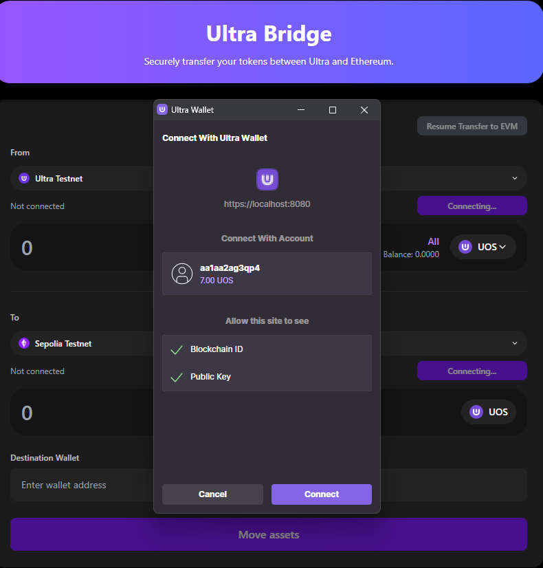
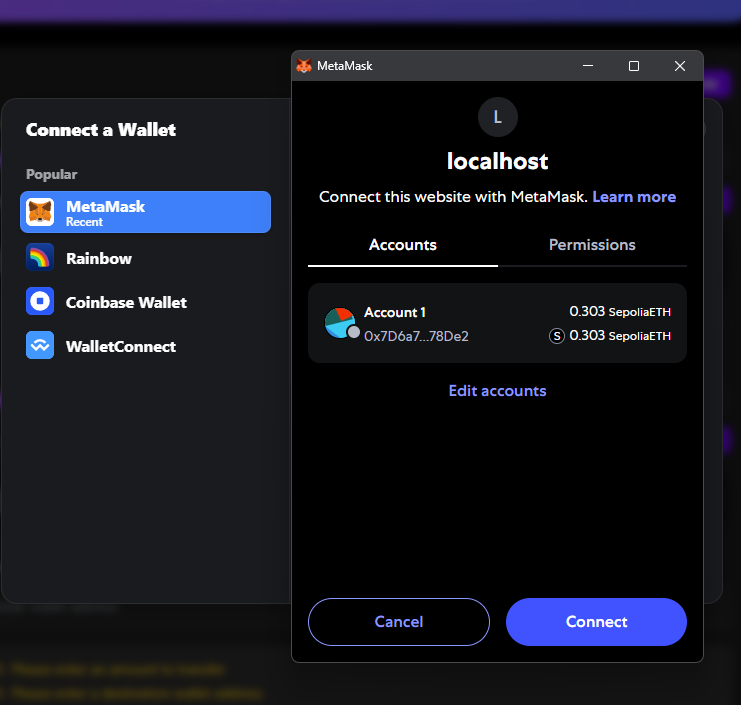
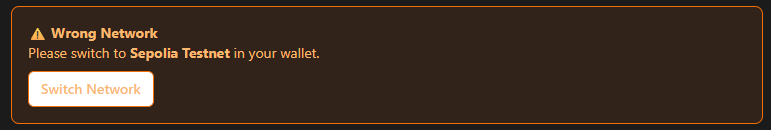

# Connect Your Wallets

Connect both Ultra and EVM wallets to start bridging tokens.

**Bridge URL**: [https://bridge.testnet.ultra.io/](https://bridge.testnet.ultra.io/)

## Connection Steps

### 1. Open Bridge Interface

Navigate to [Ultra Bridge](https://bridge.testnet.ultra.io/) - you'll see "Connect Wallet" buttons for both Network.

### 2. Connect Ultra Wallet

- **Select Ultra Testnet** network
- **Click "Connect Ultra Wallet"** in Ultra section
- **Approve connection** in wallet extension/popup
- **Verify connection** - address and UOS balance visible

### 3. Connect EVM Wallet

- **Select Ethereum Sepolia** testnet
- **Click "Connect EVM Wallet"** in EVM section
- **Choose wallet type** (MetaMask, WalletConnect, etc.)
- **Approve connection** in your EVM wallet
- **Verify connection** - address and token balances visible

## Connection Checklist

**Ultra Wallet:**
- ✅ Connected to Ultra Testnet
- ✅ Address displayed
- ✅ UOS balance visible

**EVM Wallet:**
- ✅ Connected to Ethereum Sepolia
- ✅ Address displayed
- ✅ Token balances visible

## Network Mismatch

If you see network mismatch warnings:

1. **Use "Switch Network" button** if available
2. **Manually switch** in your wallet settings
3. **Verify correct networks:** Ultra Testnet + Ethereum Sepolia

## Next Steps

1. **[Ultra→EVM Transfer](./ultra-to-evm)** - Move tokens to Ethereum
2. **[EVM→Ultra Transfer](./evm-to-ultra)** - Move tokens to Ultra
3. **[Resume Transfers](./resuming-transactions)** - Continue interrupted transfers
