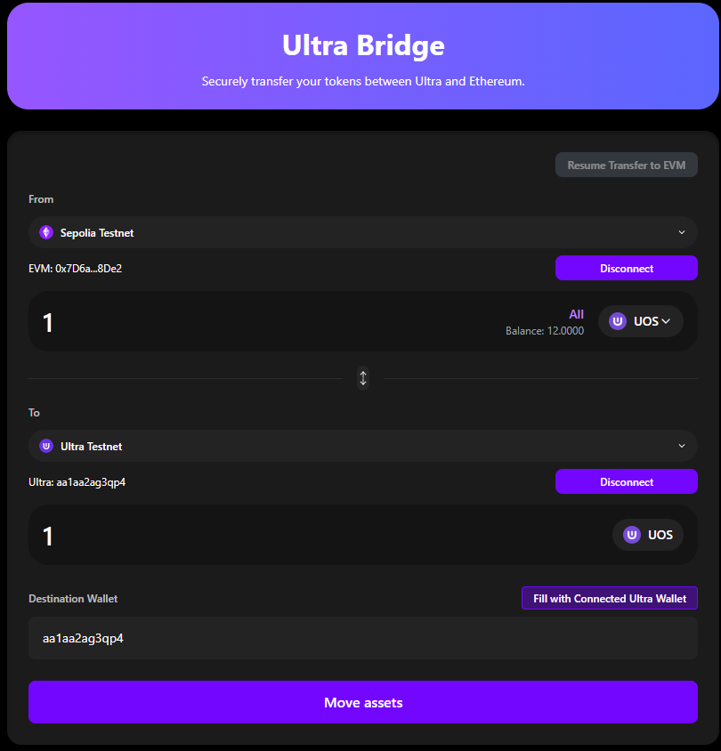
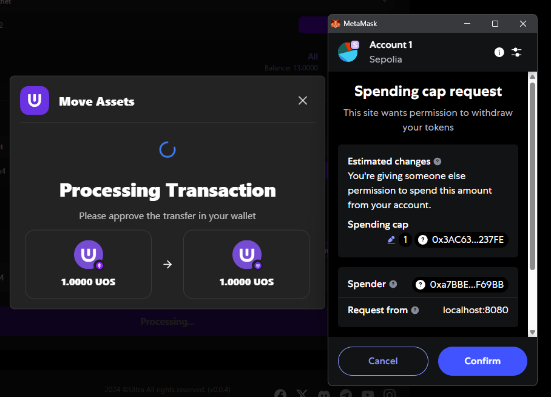
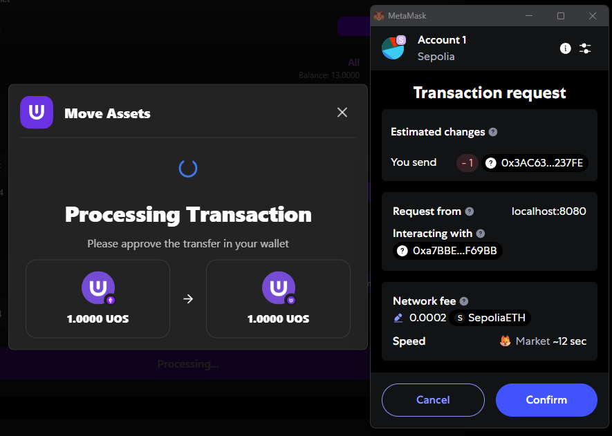
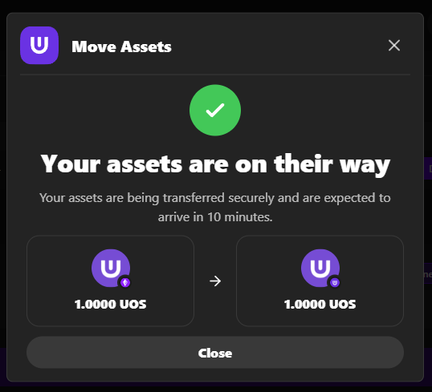

# EVM → Ultra Transfer

Transfer UOS tokens from Ethereum back to Ultra blockchain. Simpler than Ultra→EVM transfers.

**Bridge URL**: [https://bridge.testnet.ultra.io/](https://bridge.testnet.ultra.io/)

## Transfer Process

1. **Approve** - Allow bridge to spend your tokens
2. **Transfer** - Submit bridge transaction
3. **Complete** - Tokens automatically arrive in Ultra wallet

## Prerequisites

- ✅ Both wallets connected to correct networks
- ✅ UOS tokens in EVM wallet (previously bridged)
- ✅ Sepolia ETH for gas fees (approval + transfer)

## Step-by-Step Transfer

### 1. Configure Transfer

- **Verify connections**: Ethereum Sepolia + Ultra Testnet
- **Select UOS token** in dropdown  
- **Enter amount** or use "All" button
- **Set destination**: Use connected Ultra address or enter manually
- **Review transaction details**

### 2. Execute Two-Step Process

**Step A: Token Approval**
- **Click "Move Assets"**
- **Approve spending cap** in EVM wallet
- **Wait for approval confirmation**

**Step B: Transfer Tokens**
- **EVM wallet opens again** automatically
- **Confirm transfer transaction**
- **Wait for transfer confirmation**

### 3. Transfer Complete

- Tokens arrive in Ultra wallet within ~15 minutes (depending on EVM network congestion)
- Success message displayed with transaction hash
- No additional claiming step required

## Key Differences vs Ultra→EVM

| Feature | EVM→Ultra | Ultra→EVM |
|---------|-------------|-------------|
| **Steps** | 2 wallet confirmations | Multiple stages + claiming |
| **Completion** | Automatic | Manual "Move Assets" required |
| **Resume** | Not available | Available if interrupted |
| **Complexity** | Simpler | More complex |

## Important Notes

**Two-Transaction Process**
- **Approval**: Allow bridge to spend your tokens (requires Sepolia ETH gas)
- **Transfer**: Actually move the tokens (requires Sepolia ETH gas)
- **No fees** on Ultra side (Ultra has no transaction fees)

**Simpler Than Ultra→EVM**
- No manual claiming step required
- Tokens arrive in Ultra wallet within ~15 minutes (depending on EVM network congestion)

## Next Steps

1. **[Ultra→EVM Transfer](./ultra-to-evm)** - Transfer tokens back to Ethereum
2. **[Maintenance Mode](./maintenance-mode)** - Understanding scheduled downtime
3. **[Troubleshooting](./troubleshooting)** - Fix common issues

## Need Help?

- **[Troubleshooting Guide](./troubleshooting)** - Common solutions
- **[Ultra Discord](https://discord.com/invite/WfJCN6YbGk)** - Community support  
- **Email**: contact@ultra.io
- **Blockchain Explorers**: Verify transactions independently
