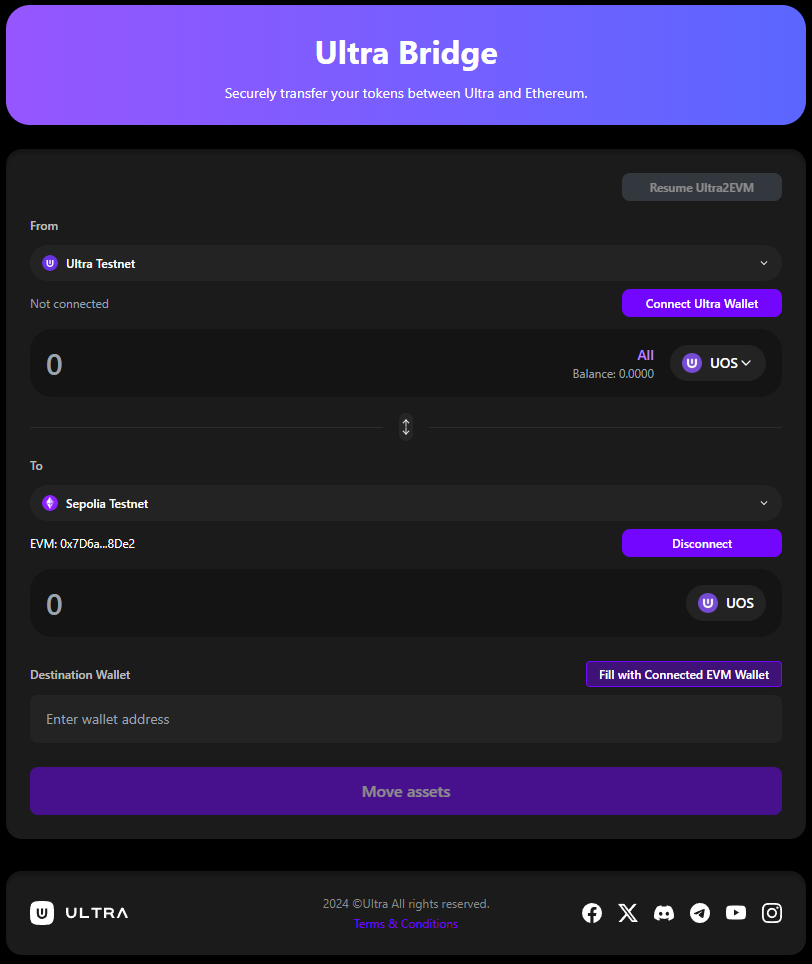

# Ultra Bridge

**Bridge URL**: [https://bridge.testnet.ultra.io/](https://bridge.testnet.ultra.io/)

Transfer UOS tokens between Ultra blockchain and Ethereum networks.

## Tutorial Flow

1. **[Setup](./getting-started)** - Install wallets and get testnet tokens
2. **[Connect](./connecting-wallets)** - Connect Ultra and EVM wallets  
3. **[Ultra → EVM](./ultra-to-evm)** - Transfer from Ultra to Ethereum
4. **[EVM → Ultra](./evm-to-ultra)** - Transfer from Ethereum to Ultra
5. **[Resume Ultra→EVM](./resuming-transactions)** - Continue interrupted Ultra→EVM transfers
6. **[Troubleshoot](./troubleshooting)** - Fix common issues

## Requirements

- Ultra Wallet (extension or web wallet)
- EVM Wallet (MetaMask, WalletConnect, etc.)
- Sepolia ETH for gas fees (claiming Ultra→EVM transfers only)

**Networks:**
- Ultra Testnet - Get tokens via [faucet](https://faucet.testnet.app.ultra.io/)
- Ethereum Sepolia

**UOS Token Contract (Sepolia)**: `0x3AC63AA2c077D676Fa24a7BCE05b05A2F81237FE`
