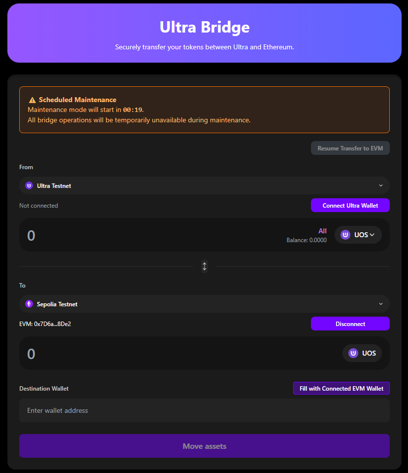
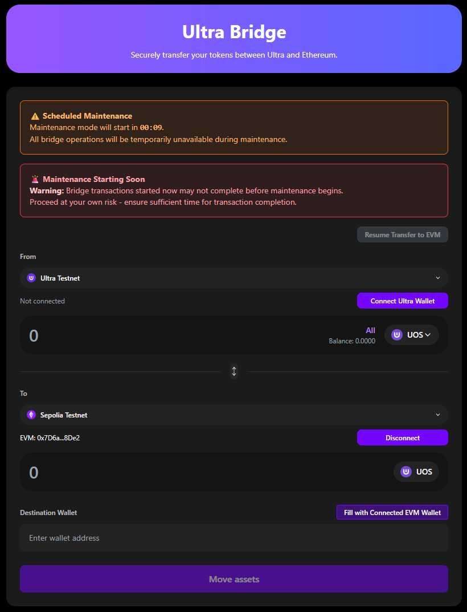
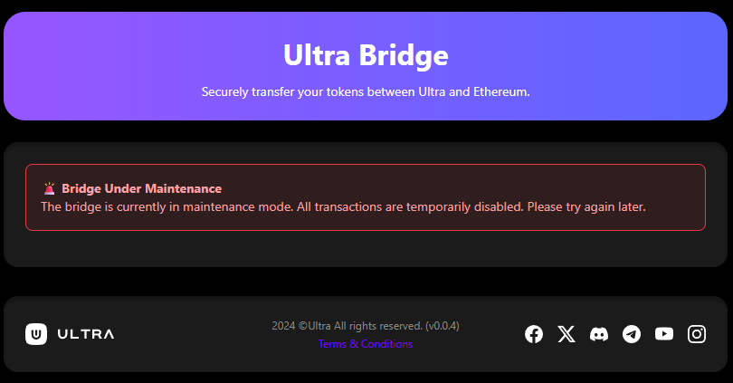

# Maintenance Mode

Understanding bridge maintenance periods and how they affect transfers.

**Bridge URL**: [https://bridge.testnet.ultra.io/](https://bridge.testnet.ultra.io/)

## Overview

Scheduled maintenance ensures bridge security and performance. **During active maintenance, ALL bridge functions are unavailable** - no new transfers, no claims, and no resume functions will work.

## Maintenance States

### 1. Scheduled Maintenance
- **Indicator**: Countdown timer to maintenance start
- **Recommended**: Complete pending transactions before deadline
- **Duration**: Announced in advance

### 2. Imminent Maintenance  
- **Indicator**: Warning with short countdown (<30 min)
- **Recommended**: Do NOT start new transactions
- **Warning**: Transfers started now may experience long delays and extended arrival times
- **Status**: Complete in-progress transfers quickly

### 3. Active Maintenance
- **Indicator**: Clear maintenance message  
- **Recommended**: Wait for maintenance completion - all bridge functions unavailable
- **Status**: All transfers, claims, and resume functions blocked

## Impact on Transfers

- **Existing transfers**: Postponed until maintenance completes
- **Ready to claim**: Cannot be claimed until maintenance ends  
- **New transfers**: Completely blocked
- **Resume function**: Unavailable during maintenance, returns afterward
- **Data safety**: All pending transfers preserved and resumable

## After Maintenance

**When maintenance ends:**
1. **Check resume function** for pending transfers
2. **Complete any ready claims**
3. **Test with small amount** first

**Transfer stuck during maintenance?** Use [Resume Function](./resuming-transactions) - this is normal behavior and transfers will continue after maintenance.

## Next Steps

1. **[Troubleshooting](./troubleshooting)** - Common issues and solutions  
2. **[Ultra→EVM Transfer](./ultra-to-evm)** - Complete transfer guide
3. **[Resume Transfers](./resuming-transactions)** - Continue interrupted transfers

## Need Help?

- **[Troubleshooting Guide](./troubleshooting)** - Common solutions
- **[Ultra Discord](https://discord.com/invite/WfJCN6YbGk)** - Community support
- **Email**: contact@ultra.io  
- **Monitor announcements** for maintenance updates
