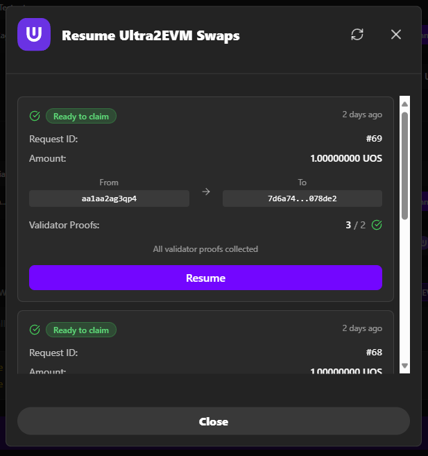
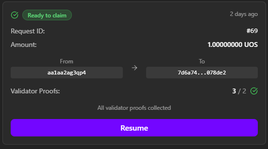

# Resume Ultra→EVM Transfers

Continue interrupted Ultra→EVM transfers. EVM→Ultra transfers complete automatically and don't need resuming.

**Bridge URL**: [https://bridge.testnet.ultra.io/](https://bridge.testnet.ultra.io/)

## When You Need Resume Ultra→EVM

**Common Scenarios:**
- Browser closed before completing Ultra→EVM transfer
- "Move Assets" step not completed in Ultra→EVM transfer
- Transaction shows "Ready to Claim" but not claimed on EVM side

**Important:**
- **Ultra→EVM transfers only** - EVM→Ultra completes automatically
- **Sepolia ETH required** for final claiming transaction on EVM

## How to Resume

### 1. Find Resume Ultra→EVM Option

- **Open bridge interface**
- **Look for "Resume" card** on main page
- **Card appears** if you have pending Ultra→EVM transfers

### 2. Select Ultra→EVM Transfer to Resume

- **Click "Resume" button/card**
- **View pending Ultra→EVM requests** in dialog
- **Select specific Ultra→EVM transaction** to continue

**Information Shown:**
- Request ID and timestamp
- Token amount and addresses
- Current status (Ready to Claim, Processing, etc.)
- Validation progress

### 3. Complete the EVM Claim

- **Check Ultra→EVM transaction status** in selected request
- **Click "Move Assets" button** if ready to claim on EVM
- **EVM wallet opens** for final confirmation
- **Review Sepolia ETH gas fees** and approve transaction
- **High fees?** You can cancel and resume later when EVM congestion is lower
- **Wait for confirmation** on Ethereum Sepolia network

### 4. Verify Completion

- Success message displayed
- Tokens arrive in EVM wallet within ~15 minutes (depending on EVM network congestion)
- Transaction marked complete

**Add UOS Token if needed:**
- Contract: `0x3AC63AA2c077D676Fa24a7BCE05b05A2F81237FE`
- Symbol: `UOS`, Decimals: `4`

## Common Resume Issues

**No Resume Card Visible**
- Ensure you have pending Ultra→EVM transactions
- Check correct network connections
- Refresh page

**Move Assets Button Not Available** 
- Verify transaction ready to claim
- Check EVM network connection
- Ensure sufficient ETH for gas

**Move Assets Transaction Fails**
- Check ETH balance for gas fees
- Verify transaction still valid
- Try Move Assets again

**Transaction Not Found**
- Verify correct networks connected
- Check transaction was actually submitted
- Review transaction hash on explorers

## Transaction States

1. **Submitted** → Sent to Ultra network
2. **Processing** → Bridge processing request
3. **Ready to Claim** → Ready for EVM completion
4. **Claiming** → User claiming on EVM
5. **Completed** → Successfully finished

**Resume needed when:**
- Browser closed before completion
- Network issues prevented finishing
- Insufficient gas caused failure
- User forgot to complete claim step

## Next Steps

1. **[Ultra→EVM Transfer](./ultra-to-evm)** - Learn the complete process
2. **[EVM→Ultra Transfer](./evm-to-ultra)** - Transfer tokens back
3. **[Troubleshooting](./troubleshooting)** - Fix common issues

## Need Help?

- **[Troubleshooting Guide](./troubleshooting)** - Common solutions
- **[Ultra Discord](https://discord.com/invite/WfJCN6YbGk)** - Community support
- **Email**: contact@ultra.io
- **Include transaction details** when seeking help
