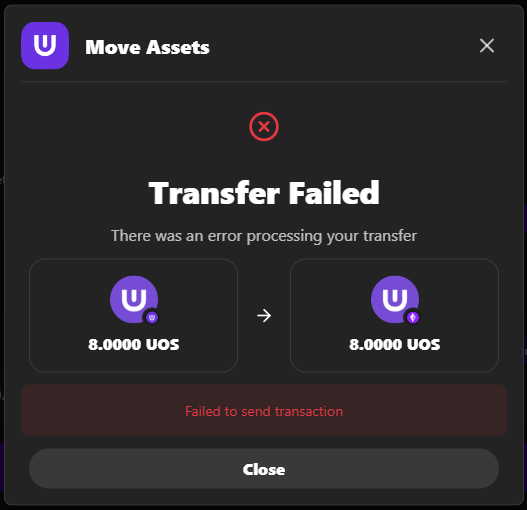

# Ultra Bridge Troubleshooting

Quick solutions for common Ultra Bridge issues.

**Bridge URL**: [https://bridge.testnet.ultra.io/](https://bridge.testnet.ultra.io/)

## Wallet Connection Issues

### Wallet Won't Connect
- Refresh page and unlock wallet extension
- Clear browser cache or try different browser
- Ensure wallet is on correct network (Ultra Testnet/Ethereum Sepolia)

### Wrong Network
- Use network switch dialog or manually switch in wallet
- Verify both Ultra and EVM wallets on correct networks
- Check network selectors in bridge interface

### Connection Timeout
- Check internet connection and refresh page
- Ensure wallet extensions are responsive
- Try disconnecting and reconnecting wallets

## Transaction Issues

### Transaction Stuck/Failed
- Ultra transactions have no fees (Ultra blockchain is feeless)
- For EVM claiming: verify sufficient Sepolia ETH for gas fees
- Wait for network confirmation (can take several minutes)
- Use resume function for Ultra→EVM transfers
- Contact support if stuck >30 minutes

### Tokens Not Visible
- **Wait up to 15 minutes** after successful Move Assets for tokens to arrive (depending on EVM network congestion)
- **Add UOS token to EVM wallet:**
  - Contract: `0x3AC63AA2c077D676Fa24a7BCE05b05A2F81237FE`
  - Symbol: `UOS`
  - Decimals: `4`

## Ultra → EVM Issues

### Missing "Move Assets" Button
- Refresh page and check transfer status dialog
- Use resume function to access claim
- Ensure EVM wallet connected with sufficient ETH

### EVM Confirmation Fails
- Check ETH balance for gas fees
- **High gas fees?** Cancel and wait for lower EVM congestion, then resume
- Verify transaction still valid
- Try confirmation again or use resume function

## EVM → Ultra Issues

### Token Approval Fails
- Ensure sufficient ETH for gas fees
- Check token contract status
- Retry approval transaction

### Transfer Fails After Approval
- Verify approval was successful
- Check ETH balance for transfer gas
- Try transfer again

## Resume Function Issues

### No Resume Card Visible
- Confirm pending Ultra→EVM transactions exist
- Check correct network connections
- Refresh page

### Cannot Claim
- Verify transaction ready to claim
- Ensure correct EVM network connection
- Check ETH balance for claim gas fees

## Maintenance Mode

### Bridge Unavailable
- Wait for maintenance completion
- Check maintenance announcements
- Monitor bridge status

### Transaction Stuck During Maintenance
- Wait for maintenance to complete
- Use resume function after maintenance
- Contact support if still stuck

## Getting Support

**When to Contact:**
- Critical issues preventing usage
- Missing tokens after successful transaction
- Persistent errors after troubleshooting

**Information to Provide:**
- Error screenshots
- Transaction hashes
- Wallet addresses (no private keys)
- Browser/wallet versions
- Steps to reproduce

**Contact Methods:**
- [Ultra Discord](https://discord.com/invite/WfJCN6YbGk)
- Email: contact@ultra.io
- [Documentation](https://developers.ultra.io/)

## Best Practices

### Prevention
- Test with small amounts first
- Verify sufficient Sepolia ETH for claiming (Ultra→EVM only)
- Confirm correct networks
- Check for maintenance announcements

### During Issues
- Document errors with screenshots
- Try basic steps: refresh, reconnect, restart
- Don't panic - most issues are resolvable

### After Resolution
- Verify functionality works
- Save transaction details
- Test with small amounts first
