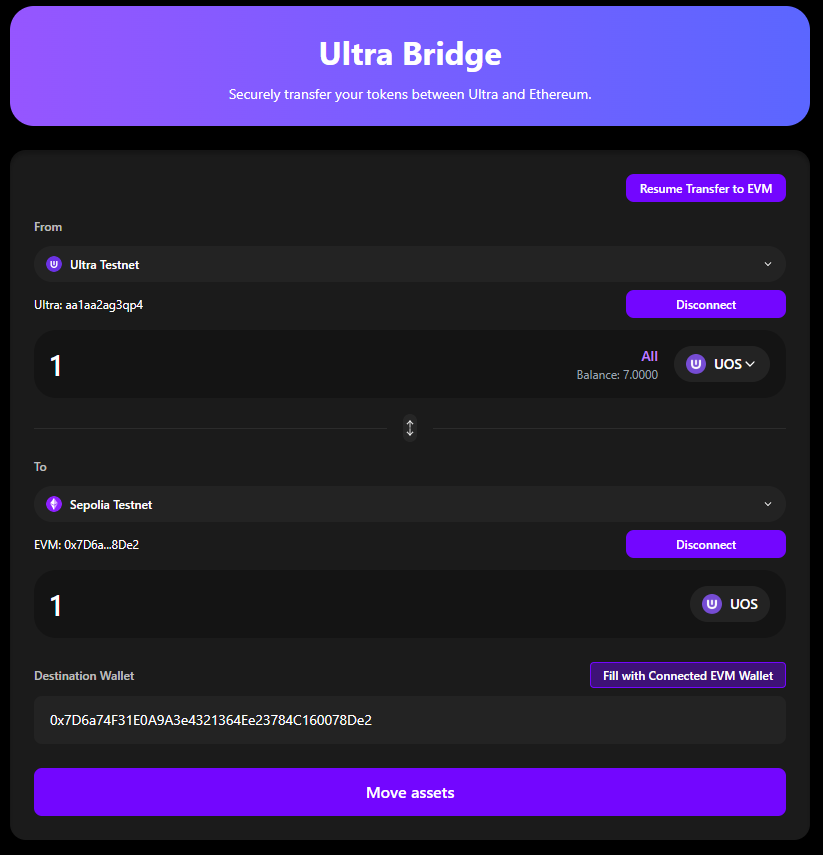
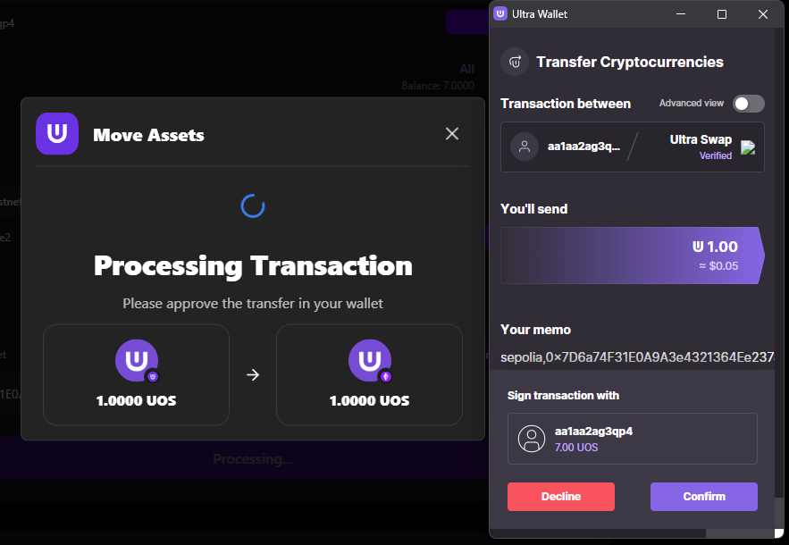
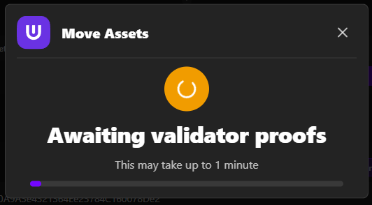
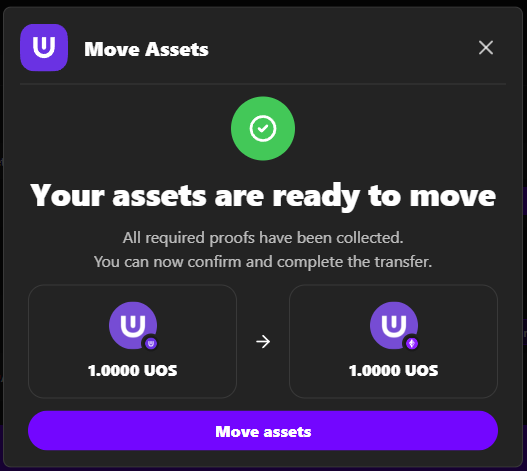
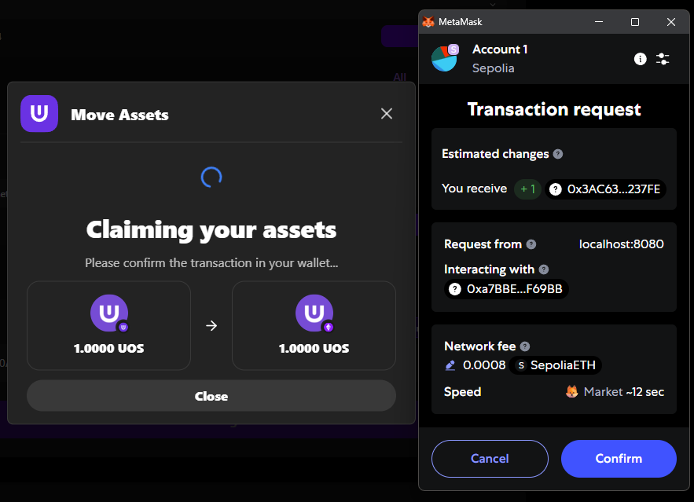
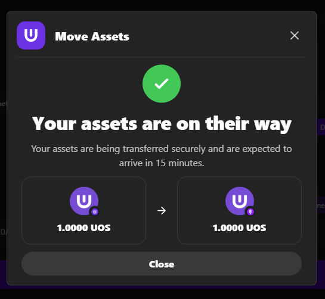

# Ultra → EVM Transfer

Transfer UOS tokens from Ultra blockchain to Ethereum network.

**Bridge URL**: [https://bridge.testnet.ultra.io/](https://bridge.testnet.ultra.io/)

## Transfer Process

1. **Submit** - Send bridge transaction on Ultra
2. **Process** - Validators confirm the transaction  
3. **Claim** - Complete transfer on Ethereum (requires "Move Assets" step)

## Prerequisites

- ✅ Both wallets connected to correct networks
- ✅ UOS tokens in Ultra wallet
- ✅ Sepolia ETH in EVM wallet for gas fees

## Step-by-Step Transfer

### 1. Configure Transfer

- **Verify connections**: Ultra Testnet + Ethereum Sepolia
- **Select UOS token** in dropdown
- **Enter amount** or use "All" button
- **Set destination**: Use connected EVM address or enter manually
- **Review transaction details**

### 2. Submit Transaction

- **Click "Move Assets"**
- **Approve in Ultra wallet**
- **Wait for Ultra network confirmation**

### 3. Monitor Progress

Transaction progresses through stages:
1. **Pending** → Submitted to Ultra
2. **Finding Request** → Processing
3. **Waiting Attestations** → Validator confirmation
4. **Ready to Claim** → Ready for EVM completion

### 4. Complete Transfer (Critical)

**⚠️ Important**: You must complete the claiming step:

- **Click "Move Assets"** button when available
- **EVM wallet opens** automatically
- **Review Sepolia ETH gas fees** (only fee in the process) and confirm
- **Wait for confirmation** on Ethereum network

### 5. Verify Success

- Success message displayed
- Transaction hash provided
- Tokens arrive in EVM wallet within ~15 minutes (depending on EVM network congestion)

**Add UOS Token to Wallet:**
- Contract: `0x3AC63AA2c077D676Fa24a7BCE05b05A2F81237FE`
- Symbol: `UOS`
- Decimals: `4`

## Important Notes

**Two-Step Process**
- Ultra→EVM requires manual completion with "Move Assets" button
- Keep browser open during entire transfer
- EVM wallet confirmation required at the end

**Gas Fees Required**
- **No fees** on Ultra network (Ultra has no transaction fees)
- **Sepolia ETH** for final EVM confirmation (only fee in the process)
- **High fees?** You can wait for lower EVM congestion and resume the transfer later

**If Something Goes Wrong**
- Use **[Resume Function](./resuming-transactions)** for interrupted transfers
- Check **[Troubleshooting Guide](./troubleshooting)** for common issues

## Next Steps

1. **[EVM→Ultra Transfer](./evm-to-ultra)** - Transfer tokens back to Ultra
2. **[Resume Transfers](./resuming-transactions)** - Continue interrupted transfers
3. **[Troubleshooting](./troubleshooting)** - Fix common issues

## Need Help?

- **[Troubleshooting Guide](./troubleshooting)** - Common solutions
- **[Resume Function](./resuming-transactions)** - Continue interrupted transfers
- **[Ultra Discord](https://discord.com/invite/WfJCN6YbGk)** - Community support
- **Email**: contact@ultra.io
